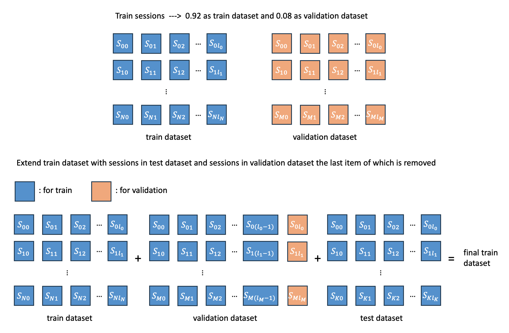
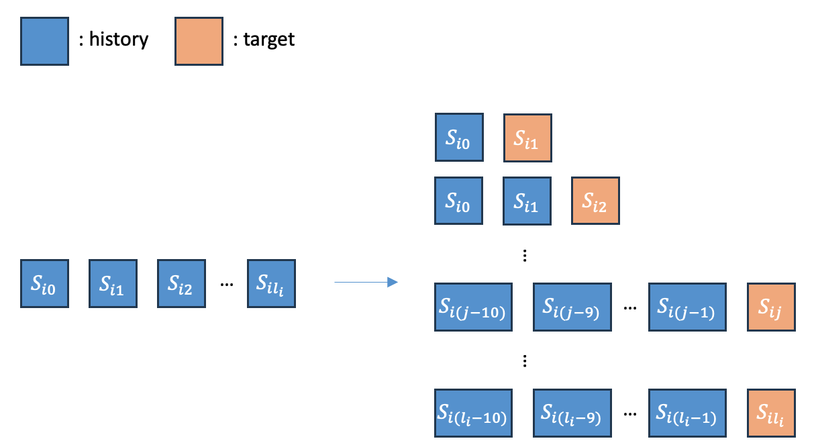

# 3rd Place Solution for Task1: Next Product Recommendation of Amazon KDD Cup 2023 - CXL's Part

## Overview

The objective of the task 1 is to make recommendation for the next item in a session in DE, JP, and UK. We use three types of single models, including deep recommendation system models, text models, and statistics-based co-graph models to retrieve candidates for every session. And then a reranker is trained to obtain more accurate ranking results.  

## Data Preparation

### Data Split

- Run `data_preprocess/phase2/data_split.ipynb` with random seed `2022`  to split data. 

In phase 2 we use the same data split as LYX. We split data separately for every locale and train individual models for every locale.

First, for every locale, we split the training sessions into the training dataset and validation dataset in a ratio of 0.92 to 0.08. We utilize the last items in sessions of the validation dataset to assess models' performance offline.  And second, we remove the next items of the sessions in the validation dataset and use the sessions without the next items in the validation dataset and test dataset to extend the training dataset. The figure below shows this process. 

### Product Feature Process

- Run `data_preprocess/product_feature_process.ipynb` to get the processed product. 

Product features are processed before they are used by models.

For color, we discard unpopular colors and split color text containing multi-colors into a color list. 

For price, we replace the abnormal price 40000000.07 with the average price in the corresponding locale. 

For brand, material, and author, we converted all the words to lowercase. 

And we append color, brand, material, and author features to the end of the title and desc features. 

## Train Single Model 

We primarily utilized three types of single models, including deep recommendation system models, text models, and statistics-based co-graph models. 

### Deep Recommendation Models using RecStudio

We use [RecStudio](https://github.com/ustcml/RecStudio) to implement all the deep recommendation models. 

We employed four models with different frameworks to model sessions, including SASRec(transformer), GRU4Rec(GRU), NARM(GRU+Attention) and SeqMLP(MLP). Additionally, we enhanced the performance of the base models by incorporating non-textual item features and item text representations obtained from text encoders.

We train a separate recommendation system model for each locale on its corresponding item set because we found that yields significantly better results compared to training a single model for all three locales. 

**Training method**: For an item within a session, we utilize up to 10 most recent items to make prediction for it.  Every session is cut into several slices to use every item except the first in the session as a training target. The figure below shows the training method. 

**Loss function**: For all recommendation system models, to achieve better model performance, we train the models using full softmax loss function on the entire item set. The formula for full softmax loss function is as follows: 

$$ p_{i, j} = \frac{ \mathrm{exp}(\mathbf{u}_{i}^{\top} \mathbf{v}_{j}) }{ \sum_{k}^{\left | I \right | } \mathrm{exp}(\mathbf{u}_{i}^{\top} \mathbf{v}_{k}) } $$

$$ loss = \sum_{i}^{\left | U \right |}- \mathrm{log}(p_{i, target_{i}}) $$

**How to run**:

- **Run** `./RecStudio/run.py` with corresponding arguments to start to train a recommendation model and prediction on test dataset will be done automatically once the training is ended. 
- After the predictions on test dataset in three locales are got, **run** `./notebooks/merge_locale.ipynb` to merge them as the final prediction. 
- **Run** `./RecStudio/run.py` with `--encode_query=1` to encode sessions and items. Sessions embeddings and items embeddings will be saved in `./candidates_phase2` and they are used to calculate the similarity between a session and a candidate in features generation of reranker. 

**Scripts and logs**: 

 The scripts with hyperparameters for training and query encoding of all models are saved in `./saved_scripts` and logs are saved in `./saved_logs`. 

### Text Models using xlm-RoBERTa and Bert 

The products possess rich textual features, including titles and descriptions. To fully leverage the textual information of the products, we utilize text encoders to obtain text representations for both items and sessions. The text representations of the items are used to enhance the performance of the base recommendation system models, and the scores between the sessions and their candidates generated by text models are also utilized as a feature for the reranker.

**Environment**: We use four **3090(24GB)** GPUs to train text models, it takes about 8~12 hours to train a single Bert.    

**Text Models**: We use xlm-RoBERTa and Bert as our text models. xlm-RoBERTa is a multilingual model so we train a single xlm-RoBERTa on all three locales using all training data, while for Bert, we train three Berts in three language. 

| models                                     | link                                                         |
| ------------------------------------------ | ------------------------------------------------------------ |
| XLM-RoBERTa                                | https://huggingface.co/xlm-roberta-base                      |
| bert-base-german-cased (DE)                | https://huggingface.co/bert-base-german-cased                |
| bert-base-japanese-whole-word-masking (JP) | https://huggingface.co/cl-tohoku/bert-base-japanese-whole-word-masking |
| roberta-base (UK)                          | https://huggingface.co/roberta-base                          |

**Training method**: For each session in the training dataset, the last item is used as the target item and the recent 5 items are used as user history. We concatenate the 5 items' text to form the query and we use sampled-softmax with in-batch negative sampling. 

**How to run**:

- Run `./text_method/run_bert.py` to train a text model. 
- Run `./text_method/run_bert.py` using `--do_predict` with `--prediction_on=valid/test/all_items` to encode validation/test sessions and all items to get their representations. 
- Run `./reorder_product_title_vectors.ipynb` to reorder the item representations according to the order used in base recommendation models to provide items' text feature for them. 
- Run `./text_method/test.py` to retrieve candidates for sessions. 

**Scripts**: All scripts for training, inference, and test are in `./saved_scripts/text_models`. 

### Co-graph models 

We utilize a certain strategy to calculate the co-occurrence relationships between items and use the item that has the highest co-occurrence count with the last item in the session or all items in the session as the next recommended item. We refer to these models as co-graph models since the co-occurrence relationships between items form a co-occurrence graph.

**How to run**:

6 strategies are designed. Co-graph count is used as a feature for reranker. 

- Run `./XGBoost/merge_features/merge_co_graph_score.ipynb` and `XGBoost/merge_features/merge_all_items_co_graph_score.ipynb` to merge the co-graph counts into the feature set of reranker. 

## Train Reranker

We use XGBoost to train a reranker on the validation dataset, and use the trained reranker to infer on the test dataset to get the final submission. 

In the last few days, my teammates and I merged our features and fine-tuned XGBoost. Our best result was obtained by ensembling three XGBoost models with different features and parameters using average score. The final version XGBoost can be seen in LYX's repository. 

**Get candidates for sessions**:

The final candidates are obtained by merging the candidates from the three methods.

1. 100 candidates from LYX's `sasrec_i2i` (Unirec/output/DE_final_dataset/SASRec/i2i/SASRec.2023-05-25_042825.2.txt in LYX's repository)
2. 100 candidates from `xlm-roberta`
3. top-100 candidates from a  `co-graph ` model 

Run `./XGBoost/merge_candidates.ipynb` to merge them. 

**Features**:

- scores and the normalized scores from recommendation models 
- scores and the normalized scores from text models 
- scores from BM25
- co-graph counts using 6 strategies 
- statistical features, such as the average price of session/price of the candidate, item frequency, next item frequency and so on 

Run all the notebooks in `XGBoost/merge_features` and `XGBoost/merge_features/test` to merge all the features. 

**How to run**:

- Run `/Amazon-KDDCUP-23/XGBoost/my_xgboost.py` to train a xgboost
- Run `/Amazon-KDDCUP-23/XGBoost/my_xgboost_infer.ipynb` to infer on test dataset. 
